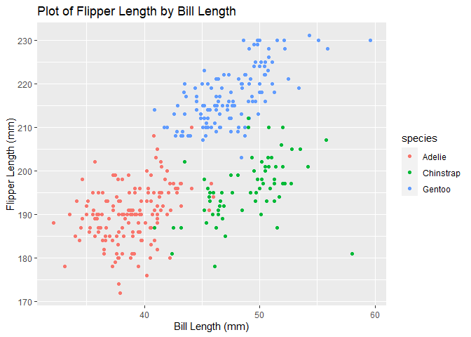

P8105 Homework 1
================
sarah8105

This is my first homework assignment for P8105. This assignment
demonstrates the use of git and R Markdown documents.

``` r
library(tidyverse)
```

    ## -- Attaching packages --------------------------------------------------------------------- tidyverse 1.3.0 --

    ## v ggplot2 3.3.2     v purrr   0.3.4
    ## v tibble  3.0.3     v dplyr   1.0.2
    ## v tidyr   1.1.2     v stringr 1.4.0
    ## v readr   1.3.1     v forcats 0.5.0

    ## -- Conflicts ------------------------------------------------------------------------ tidyverse_conflicts() --
    ## x dplyr::filter() masks stats::filter()
    ## x dplyr::lag()    masks stats::lag()

## Problem 1

The following code chunk creates a data frame comprised of:

  - A random sample of size **10** from a standard Normal distribution
  - A logical vector indicating whether elements of the sample are
    greater than 0
  - A character vector of length **10**
  - A factor vector of length **10**, with factors *low*, *middle*, or
    *high*

<!-- end list -->

``` r
problem1_df = 
  tibble(
    samp = rnorm(10),
    samp_gt_0 = samp > 0,
    char_vec = c("This", "is", "a", "character", "vector", "for", "the", "first", "homework", "problem"),
    factor_vec = factor(c("low", "middle", "high", "low", "low", "middle", "high", "low", "middle", "middle"))
  )
```

The next code chunk attempts to take the mean of each variable.

``` r
mean(pull(problem1_df, samp))
```

    ## [1] 0.1022347

``` r
mean(pull(problem1_df, samp_gt_0))
```

    ## [1] 0.6

``` r
mean(pull(problem1_df, char_vec))
```

    ## Warning in mean.default(pull(problem1_df, char_vec)): argument is not numeric or
    ## logical: returning NA

    ## [1] NA

``` r
mean(pull(problem1_df, factor_vec))
```

    ## Warning in mean.default(pull(problem1_df, factor_vec)): argument is not numeric
    ## or logical: returning NA

    ## [1] NA

The mean of the random numeric variable is 0.1 and the mean of the
logical variable is 0.6. Means are unable to be calculated from the
character or factor variables since these variables cannot be implicitly
coerced into numeric variables. R implicitly coerces logical variables
to numeric when taking the mean.

The following code chunk attempts to convert the logical, character, and
factor vectors to numeric.

``` r
as.numeric(pull(problem1_df, samp_gt_0))
```

    ##  [1] 1 0 0 1 1 0 0 1 1 1

``` r
as.numeric(pull(problem1_df, char_vec))
```

    ## Warning: NAs introduced by coercion

    ##  [1] NA NA NA NA NA NA NA NA NA NA

``` r
as.numeric(pull(problem1_df, factor_vec))
```

    ##  [1] 2 3 1 2 2 3 1 2 3 3

The factor and logical vectors are successfully converted to numeric
vectors (with *TRUE = 1* and *FALSE = 0* and with *low = 2*, *middle =
3* and *high = 1* respectively).

Using the `as.numeric` function can explicitly convert a factor variable
to its underlying numeric code, though this may not be a meaningful
numeric value. The character vector cannot be implicitly or explicitly
converted to numeric, so a mean cannot be calculated.

Next, the code multiplies the results of the conversion of the logical,
character, and factor vectors to numeric by the random sample.

``` r
as.numeric(pull(problem1_df, samp_gt_0)) * pull(problem1_df, samp)

as.numeric(pull(problem1_df, char_vec)) * pull(problem1_df, samp)
```

    ## Warning: NAs introduced by coercion

``` r
as.numeric(pull(problem1_df, factor_vec)) * pull(problem1_df, samp)
```

This code demonstrates that you can multiply a variable that gets
converted to numeric by a numeric variable.

## Problem 2

Problem 2 downloads the `penguins` data set from the `palmerpenguins`
package.

``` r
data("penguins", package = "palmerpenguins")
```

The penguins data set contains 344 observations and 8 variables.
Variables in this data set include:

  - species
  - island
  - bill\_length\_mm
  - bill\_depth\_mm
  - flipper\_length\_mm
  - body\_mass\_g
  - sex
  - year

The species in this data set include: Adelie, Gentoo, Chinstrap. Years
included in this data set are 2007, 2008, 2009.

The mean flipper length is 200.92 mm, and the mean bill length is 43.92
mm.

The next code chunk creates a scatter plot of flipper length by bill
length, color coded by species of penguin.

``` r
ggplot(penguins, aes(x = bill_length_mm, y = flipper_length_mm, color = species)) + 
  geom_point() +
  xlab("Bill Length (mm)") +
  ylab("Flipper Length (mm)") +
  ggtitle("Plot of Flipper Length by Bill Length")
```

    ## Warning: Removed 2 rows containing missing values (geom_point).

<!-- -->

``` r
ggsave("p8105_hw1_problem2_sec2209.png")
```

    ## Saving 7 x 5 in image

    ## Warning: Removed 2 rows containing missing values (geom_point).

From this scatterplot, it is apparent that flipper length and bill
length are positively correlated. Flipper and bill lengths also tend to
be clustered by species. The Adelie species generally exhibit lower bill
lengths and flipper lengths. The Gentoo species generally exhibit higher
bill lengths and flipper lengths. The Chinstrap species generally
exhibit higher bill lengths but lower flipper lengths.
